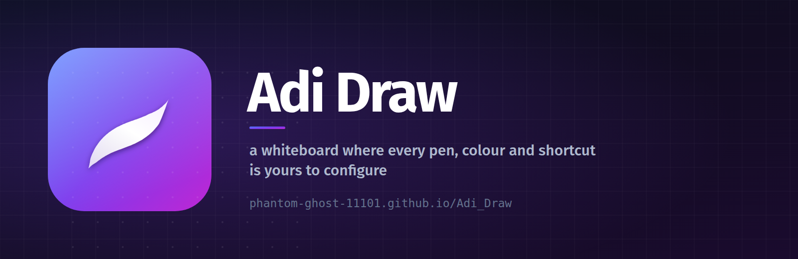
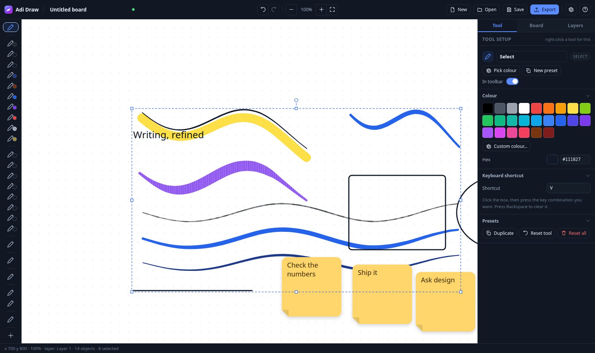

<div align="center">



# ✏️ Adi Draw

**A whiteboard where every pen, colour and shortcut is yours to configure.**

Pressure-sensitive ink · shapes · sticky notes · layers · 500-step undo ·
incremental renderer · works offline · zero runtime dependencies

[Open it in the browser](https://phanthom-ghost-11101.github.io/Adi_Draw/) ·
[Report an issue](https://github.com/PhaNtoM-GHosT-11101/Adi_Draw/issues) ·
[Download the desktop app](https://github.com/PhaNtoM-GHosT-11101/Adi_Draw#desktop-app)

</div>

---

Most whiteboards give you a fixed toolbar. Adi Draw gives you the *pen itself*.

Every tool is a preset you can open up and take apart — line width, pressure
response, a draggable pressure curve, tilt, stabiliser, taper, blend mode, dash
pattern, font, shortcut key — then save as your own. Make a "Chisel Nib" for
lettering, a "Ballpoint" for notes, a heavy "Pencil" for sketching, and give
each one its own key.

<p align="center">
  
</p>

---

## Contents

- [Try it](#try-it) · [Desktop app](#desktop-app) · [Run it yourself](#run-it-yourself)
- [Why it's built this way](#why-its-built-this-way)
- [The seven stroke controls](#the-seven-stroke-controls-in-plain-english)
- [Tools included](#tools-included)
- [Writing](#writing)
- [Keyboard](#keyboard)
- [Files](#files)
- [Performance](#performance)
- [Testing](#testing)
- [Architecture](#architecture)
- [Browser support](#browser-support) · [License](#license)

---

## Try it

**In a browser —** no install, no account, nothing leaves your device:

> <https://phanthom-ghost-11101.github.io/Adi_Draw/>

Boards autosave to IndexedDB, so closing the tab does not lose your work. Save a
copy as `.wbd` whenever you like.

**As an app —** native window, real file dialogs, no browser chrome:

| Linux | Windows | macOS |
| --- | --- | --- |
| `.AppImage` / `.deb` | `.exe` (NSIS) | `.dmg` |

Grab a release build from the
[releases page](https://github.com/PhaNtoM-GHosT-11101/Adi_Draw/releases), or
build it yourself with `npm run dist`.

## Run it yourself

```bash
git clone https://github.com/PhaNtoM-GHosT-11101/Adi_Draw.git
cd Adi_Draw
npm install

npm run dev        # browser on http://localhost:5273
npm run desktop    # native Electron window
npm run dist       # packaged installer in release/
npm test           # typecheck + 58 end-to-end checks
npm run deploy     # rebuild and publish to the gh-pages branch
```

Plain TypeScript, no UI framework, **no runtime dependencies**. React, tldraw,
Konva, Excalidraw — none of it. The canvas draws the board, the DOM draws the
panels, and nothing else gets in the way.

---

## Why it's built this way

Because the interesting problems in a drawing app aren't the toolbar.

**The input filter is a real One Euro filter.** Tremor in a line usually comes
from averaging away the noise — which also adds lag, which is why so many
whiteboards feel rubbery. A One Euro filter ([Casiez et al., CHI 2012](https://gery.casiez.net/1euro/))
adapts its cutoff to speed instead: it smooths hard when you write slowly and
barely touches fast strokes. The result is clean handwriting with no visible
lag, and the *Stabiliser* slider is just the cutoff frequency.

**The renderer only repaints what changed.** The committed board lives on its
own canvas. Every edit reports the world-space rectangle it touched, and only
that rectangle is repainted; panning is a scrolling blit where just the newly
exposed edges are redrawn. On a 4 000-object board that turns a 65 ms full
repaint into a ~1 ms partial one. `test/incremental.mjs` asserts this stays
pixel-exact after moving, deleting, panning, zooming, undoing and hiding
layers.

**Canvas and SVG share one geometry function.** `outlinePathData()` returns an
SVG path string; `Path2D` accepts that same string. What you see on screen and
what lands in an exported file are generated by the same code, so they cannot
drift apart.

**Undo is op-based, not snapshot-based.** Moves and edits record
add/delete/modify operations, so undoing something on a 50 000-object board is
instant.

---

## The pens

Ten freehand instruments, and none of them is a rounded rectangle:

| Pen | Shortcut | What it does |
| --- | --- | --- |
| **Pencil** | `P` | Graphite grain, tilt-responsive. The line breaks up slightly like real lead. |
| **Pen** | `B` | Crisp and constant. Pressure does the work. |
| **Ballpoint** | `U` | Even width, quick, no drama. High gamma so light touches stay thin. |
| **Fountain Pen** | `F` | Wide on downstrokes, fine on upstrokes. Pressure *and* tilt. |
| **Chisel Nib** | `J` | Pressure almost off, tilt at 100% — the width follows how you hold the pen, so turning it mid-stroke gives you broad-edge lettering. |
| **Marker** | `M` | Bold and even. The annotation default. |
| **Paint Brush** | `A` | Big, loaded, with visible bristle streaks. |
| **Crayon** | `Y` | Waxy clumps that skip across the tooth of the paper. |
| **Chalk** | `C` | Dusty and low-contrast, barely there. |
| **Highlighter** | `H` | Multiply blend, so it inks over what's underneath instead of covering it. |

### Surfaces

Crayon, chalk, graphite and bristle are not drawn with a flat fill — that is
exactly what makes most whiteboard "crayons" look like markers. Each surface is
a seamless tile of **periodic value noise** filled *over* a thin flat underlay,
so the gaps read as bare paper instead of as holes punched through whatever you
drew earlier. The grain lives in world space, so it belongs to the page: pan and
zoom and it stays put, like real pigment.

Every freehand tool has a **Surface** section, so you can put a waxy finish on
the fountain pen or a bristle finish on a marker. Two controls:

- **Grain size** — `1×` is the raw tile; smaller is finer.
- **Body opacity** — how much flat colour sits beneath the texture. Lower it for
  a scratchier, drier line.

> Exports: the PNG carries the real texture. The SVG carries an
> `feTurbulence` filter for the grain-like surfaces; bristle has no cheap vector
> equivalent, so those strokes export flat and are tagged
> `data-texture="bristle"` if you want to post-process them.

## The seven stroke controls, in plain English

| Control | What it does |
| --- | --- |
| **Pressure** | How much stylus pressure controls line width. `0` = constant width, `1` = full range. |
| **Pressure curve** | A draggable pad that reshapes the response. Push it left for a dark, heavy line; right for a light one. |
| **Min width** | The width the line keeps when you barely touch the tablet. |
| **Tilt** | How much stylus *tilt* thickens the line — the shading trick on a real pencil. |
| **Steadiness** | Tremor removal, `0` = raw tablet input, `1` = very steady. |
| **Response** | How fast the filter gets out of the way when you speed up. High = follows fast strokes instantly. |
| **Width smoothing** | Keeps the line from wobbling when the pressure signal is noisy. |
| **Speed thinning** | Fast strokes get thinner, like a real pen. |
| **Surface** | Smooth, or waxy / graphite / chalk / bristle. See [the pens](#the-pens). |
| **Taper in / out** | Narrows the stroke at its start and end. |
| **Blend** | Normal, Multiply, Screen, Overlay, Darken, Lighten, Atop, Erase. Multiply is what gives a highlighter its inky look over other ink. |

> **With a mouse** only Steadiness, Response, Speed thinning and the tapers have
> any effect — there's no pressure or tilt to read.

## Tools included

**Freehand** — see [the pens](#the-pens) below, plus a laser pointer
**Shapes** — Line, Arrow, Rectangle, Ellipse, Diamond, Triangle, Star, Polygon
**Objects** — Text, Sticky notes, Images (paste with `Ctrl+V`)
**Erasing** — Ink eraser (rubs out pixels, like eraser on paper) and
whole-object eraser (removes the whole stroke)

Right-click any tool to jump straight to its setup. **Duplicate** to keep the
original and tweak a copy, **Apply to all** to push a style onto every tool of
that kind, **In toolbar** to hide one you never use. Presets save themselves.

## Writing

Adi Draw reads `PointerEvent.pressure` and samples coalesced events, so you get
your tablet's full input rate. Each sample keeps its own timestamp, which is
what lets the filter behave properly at 240 Hz.

**Palm rejection** is on by default: once a stylus has been seen, finger touches
are ignored for 1.5 s (**Board → Input**), so the hand resting on the tablet
won't draw.

A couple of starting points for handwriting:

- **Fountain Pen** — `Gamma 0.65`, `Tilt 60%`. Wide on downstrokes, fine on
  upstrokes, like a real nib.
- **Ballpoint** — `Gamma 1.6`, `Min width 55%`. Even line, quick, no drama.
- **Chisel Nib** — `Pressure 25%`, `Tilt 100%`. Let the pen do the work.
- **Pencil** — `Tilt 55%`, `Steadiness 50%`. Good for sketching.

> Rotate the pen while the Chisel tool is selected: the tilt-driven width turns
> the stroke as you turn, which is how broad-edge lettering works.

## Keyboard

| | | | |
| --- | --- | --- | --- |
| Draw | drag | Pan | `Space`+drag · middle mouse · two fingers |
| Zoom | `Ctrl`+scroll · pinch | Zoom to fit | `Ctrl+1` |
| Select | `V` | Select all | `Ctrl+A` |
| Add to selection | `Shift`+click | Constrain move | `Shift`+drag |
| Scale | drag a corner handle | Keep aspect | `Shift`+drag |
| Rotate | drag the handle on top | 15° steps | `Shift`+drag |
| Nudge | arrows (`Shift` = 10 px) | Duplicate | `Ctrl+D` |
| Delete | `Delete` | Cancel | `Esc` |
| Forward / back | `Ctrl+]` / `Ctrl+[` | Front / back | `Ctrl+Shift+↑` / `↓` |
| Undo / redo | `Ctrl+Z` / `Ctrl+Shift+Z` | Full list | `?` |

Every tool key is rebindable: click **Shortcut** in the Tool panel, press the
combination. If another tool already owns it, that one is cleared.

## Files

- **`.wbd`** — JSON, so a board is diffable and scriptable.
- **PNG** — 1×–4× resolution, optional grid, optional transparency.
- **SVG** — genuine vector outlines. Blend modes become `mix-blend-mode`,
  layers become `<g data-layer>`. Not a rasterised screenshot.
- **Autosave** — written ~1 s after every change, restored on next launch. Turn
  it off in **Board → Input**.

## Performance

Measured in headless Chromium (software rasterisation — a real GPU is
considerably faster) on a board of **4 000 strokes**:

| | |
| --- | --- |
| Full repaint of the viewport | ~65 ms |
| Panning (blit + overlay) | **~0.1 ms** |
| Adding one small object | ~1 ms of JS |
| 240-point stroke, repainting its own box | ~1 ms of JS |
| JS heap | ~11 MB |

You can trade pixels for speed in **Board → Performance**
(Performance = 1× device pixels, Balanced = up to 2×, Quality = up to 3×), and
switch between a light and dark UI — or leave it on *Match system*.

## Testing

```bash
npm test               # typecheck + 104 checks across 6 browser suites
npm run perf           # renderer timings on a 4 000-object board
npm run test:visual    # draws a sample board to test/board.png
npm run test:svg       # exports an SVG and re-renders it to verify it
npm run test:deployed  # loads the live Pages build and draws on it
```

The suites drive a **simulated pressure stylus** through a real Chromium and
assert behaviour, not implementation:

- line width actually tracks pressure (1.93 px → 3.86 px for one stroke)
- the filter never swallows a stroke, even when every sample lands in one frame
- a dead-straight line isn't simplified into a dot
- both eraser modes do the right thing, and undo reverses them
- the laser pointer leaves nothing on the board
- tool settings, colour picker, shape fills, board tab, image paste, presets
- incremental rendering is **pixel-identical to a full repaint** after every
  kind of edit
- the exported SVG re-parses as well-formed geometry
- the dark theme follows the OS and an explicit choice overrides it
- every pen exists, and a textured stroke is measurably clumpier than a smooth one
- the published build boots, draws, survives a reload and exports

## Architecture

```
src/
  core/
    filters.ts     One Euro filter, tilt and twist normalisation
    stroke.ts      StrokeBuilder + variable-width outline as SVG path data
    shapes.ts      shape geometry, also as path data
    geometry.ts    matrices, rects, RDP simplification, colour
    transform.ts   affine transforms for move / scale / rotate
    store.ts       document, layers, selection, op-based undo, dirty rects
    types.ts       the data model
    tools.ts       default presets, palettes, icon set
    app.ts         tool-preset store + settings (localStorage)
  render/
    renderer.ts    scene canvas, dirty regions, scrolling blit, hit testing
    textures.ts    seamless value-noise surfaces for crayon, chalk, bristles
  input/
    controller.ts  pointer state machine
    shortcuts.ts   keyboard + shortcut recorder
  ui/              rail, tool inspector, layers, top bar, colour picker,
                   text editor, help overlay
  io/
    persist.ts     IndexedDB autosave, .wbd read/write
    exporter.ts    PNG and SVG export
    desktop.ts     Electron bridge (falls back to browser downloads)
electron/          main + preload
```

## Browser support

Chrome/Edge 106+, Firefox 112+, Safari 16.4+ (needs `Path2D(d)` and
`isPointInPath`). The desktop build is Electron and unaffected.

If you have a stylus, Ado don’t bother with a mouse — but it works fine either way.

## Deploying

The site is served from the `gh-pages` branch, so **a deploy is one command**:

```bash
npm run deploy
```

It typechecks, builds, strips source maps, adds a SPA `404.html`, and
force-pushes to `gh-pages`. GitHub rebuilds the branch (a minute or so) and the
live link updates.

`.github/workflows/deploy.yml` does the same thing through GitHub Actions on
every push to `main`. It is included, but pushing workflow files needs a token
with the `workflow` scope — if you have one, `git add .github && git commit`
turns it on and you can forget about `npm run deploy`.

## The artwork

`npm run icons` regenerates every image in `public/icons/`, `docs/` and
`build/` from one vector definition — the mark's tapered stroke is *computed*
with the same width-profile maths the app uses to draw ink, so the icon is a
real brush stroke rather than a stroked path.

| | |
| --- | --- |
| `public/icons/` | favicon (SVG + 16…1024 PNG), maskable, apple-touch, bare mark, web manifest, social card |
| `docs/` | `logo.svg`, `og-image.png` (1200×630), `banner.png`, UI screenshots |
| `build/icon.png` | desktop app icon for `electron-builder` |

Android gets a full-bleed maskable icon with the mark inside the safe zone;
every other icon is a rounded tile with **transparent** corners so it sits
correctly on both light and dark browser and desktop chrome.

## License

MIT — do whatever you like with it.

<div align="center">
  <sub>Built for people who want their pens to feel like <em>their</em> pens.</sub>
</div>
